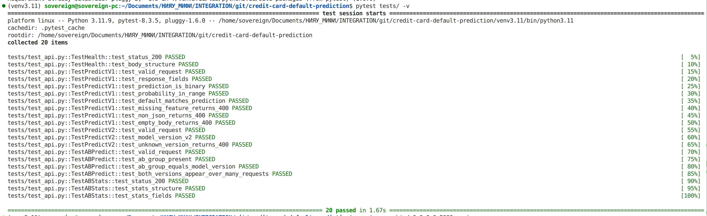
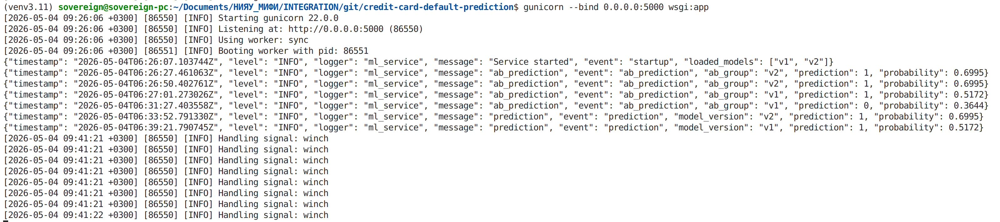
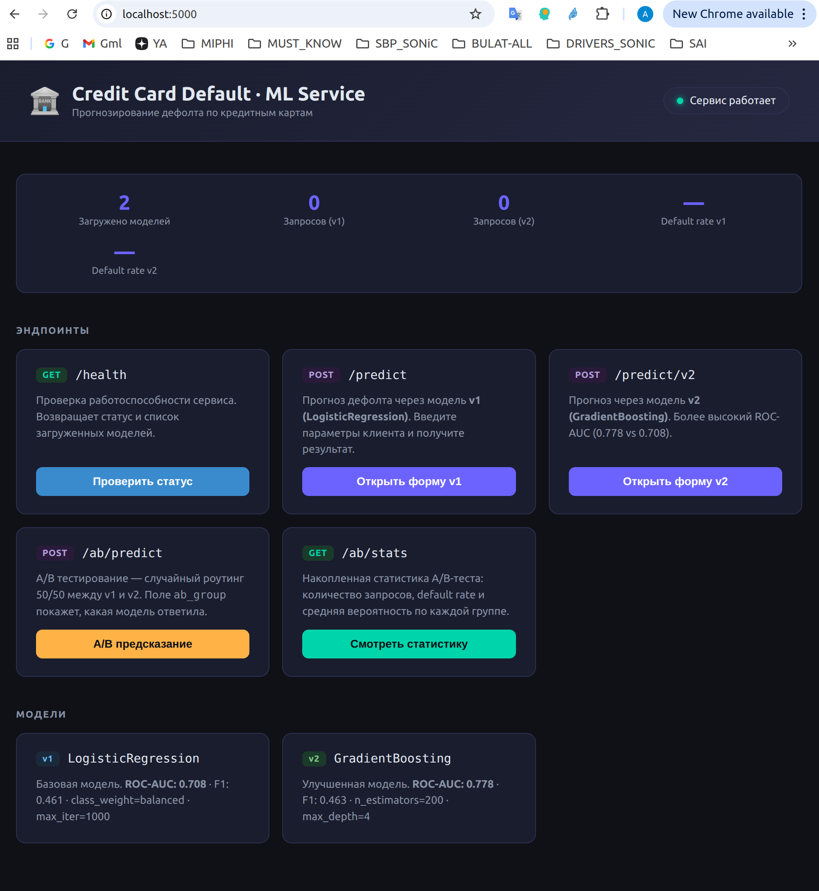
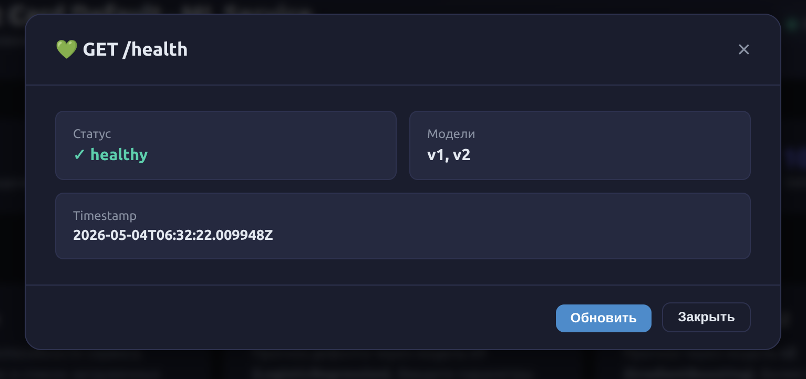
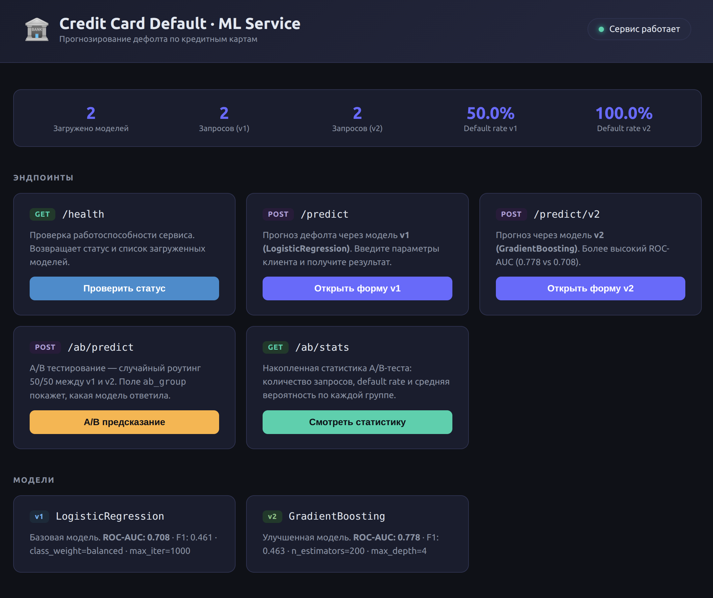
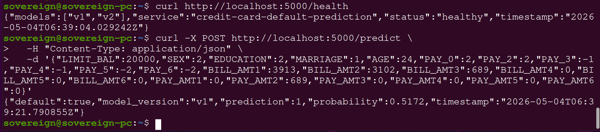
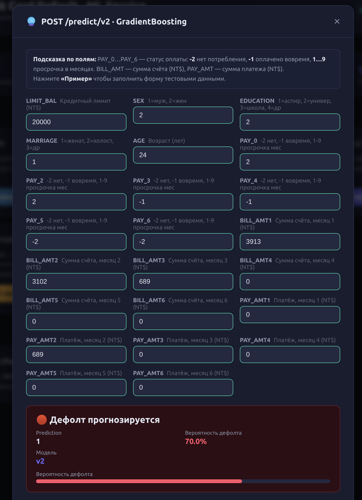
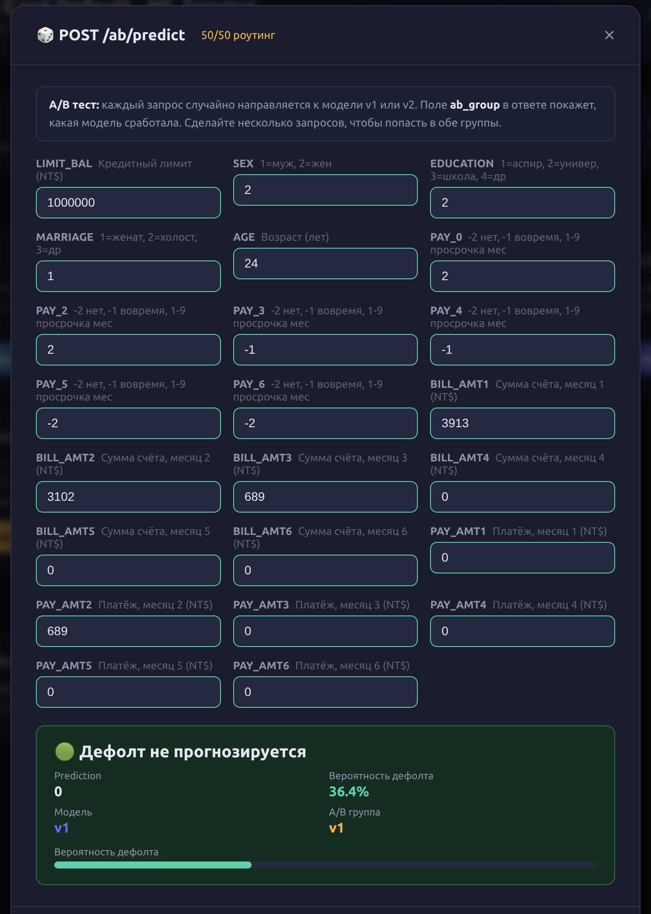
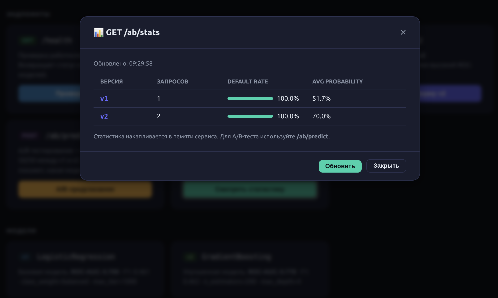
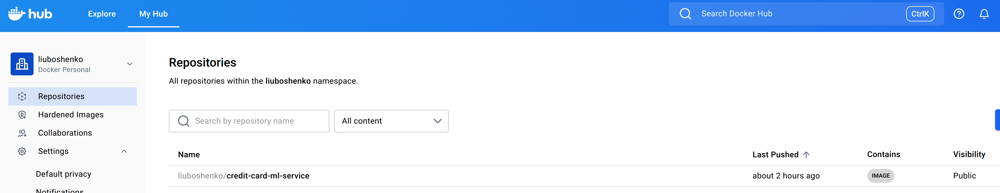

# Credit Card Default Prediction — ML Service

Сервис прогнозирования дефолта по кредитным картам, реализованный в production-like-среде с контейнеризацией и поддержкой A/B-тестирования двух версий модели.

**Датасет:** [Default of Credit Card Clients (UCI)](https://archive.ics.uci.edu/ml/datasets/default+of+credit+card+clients) — 30 000 клиентов, Тайвань, бинарная классификация (дефолт в следующем месяце).

---

## Технический стек

<p align="left">
  <a href="https://www.python.org"></a>
  <a href="https://flask.palletsprojects.com"></a>
  <a href="https://gunicorn.org"></a>
  <a href="https://scikit-learn.org"></a>
  <a href="https://pandas.pydata.org"></a>
  <a href="https://numpy.org"></a>
  <a href="https://docs.pytest.org"></a>
  <a href="https://www.docker.com"></a>
  <a href="https://nginx.org"></a>
</p>

---

## Структура репозитория

```
credit-card-default-prediction/
├── app/
│   ├── __init__.py        # Flask app factory
│   ├── api.py             # Эндпоинты: /health, /predict, /ab/predict, /ab/stats
│   ├── model_handler.py   # Загрузка и инференс моделей (joblib)
│   ├── ab_testing.py      # Thread-safe A/B менеджер
│   └── logger.py          # JSON-логирование
├── src/
│   └── preprocessing.py   # Валидация и преобразование входных данных
├── models/
│   ├── train_model.py     # Скрипт обучения (запускается вручную)
│   ├── model_v1.pkl       # LogisticRegression (class_weight=balanced)
│   └── model_v2.pkl       # GradientBoostingClassifier (n_estimators=200)
├── tests/
│   └── test_api.py        # 20 интеграционных тестов (pytest)
├── nginx/
│   └── nginx.conf         # Конфигурация обратного прокси
├── data/                  # Место для датасета
├── logs/                  # JSON-логи (создаётся автоматически)
├── notebooks/             # Jupyter-тетради (EDA)
├── config.py              # Список признаков, пути к моделям
├── wsgi.py                # WSGI точка входа (Gunicorn)
├── Dockerfile             # Multi-stage образ (python:3.11-slim)
├── docker-compose.yml     # ml-service + nginx
├── requirements.txt       # Python-зависимости
├── ARCHITECTURE.md        # Архитектурный разбор (монолит vs микросервисы, MLOps)
└── ab_test_plan.md        # Полный план A/B-теста со статистическим анализом
```

---

## Часть 1 — Быстрый старт (локально)

### Шаг 1. Клонировать / перейти в проект

```bash
git clone <your-repo-url>
cd credit-card-default-prediction
```

### Шаг 2. Создать и активировать виртуальное окружение

```bash
python3.11 -m venv venv3.11
source venv3.11/bin/activate          # Linux / macOS
# venv3.11\Scripts\activate           # Windows
```

### Шаг 3. Установить зависимости

```bash
pip install -r requirements.txt
```

### Шаг 4. Обучить модели

Файл датасета `UCI_Credit_Card.csv` должен находиться рядом с папкой проекта (или передайте путь через `--data`):

```bash
# датасет на уровень выше (структура по умолчанию)
python models/train_model.py

# или явный путь
python models/train_model.py --data /path/to/UCI_Credit_Card.csv
```

После выполнения в папке `models/` появятся `model_v1.pkl` и `model_v2.pkl`.

**Ожидаемый вывод:**
```
Model v1 — LogisticRegression   ROC-AUC=0.7081  F1=0.4612
Model v2 — GradientBoosting     ROC-AUC=0.7779  F1=0.4634
```

### Шаг 5. Запустить тесты

```bash
pytest tests/ -v
```



### Шаг 6. Запустить сервис

```bash
python wsgi.py
# Сервис доступен на http://localhost:5000
```

Или через Gunicorn (production-режим):

```bash
gunicorn --bind 0.0.0.0:5000 wsgi:app
# или с несколькими воркерами
gunicorn --bind 0.0.0.0:5000 --workers 2 wsgi:app
```





---

## Часть 2 — Запуск в Docker

### Предварительные требования

- Docker ≥ 24.0
- Обученные модели (`models/model_v1.pkl`, `models/model_v2.pkl`) уже должны быть в папке

### Шаг 1. Собрать образ

```bash
docker build -t credit-card-ml-service:latest .

# Для контроля версии
docker build -t credit-card-ml-service:latest_v1 .
```

### Шаг 2. Запустить контейнер

```bash
docker run -d \
  --name credit_ml \
  -p 5000:5000 \
  -v $(pwd)/logs:/app/logs \
  credit-card-ml-service:latest
```

### Шаг 3. Проверить здоровье

```bash
curl http://localhost:5000/health
```

---

## Часть 3 — Docker Compose (ml-service + nginx)

```bash
docker-compose up -d
```

Сервис будет доступен через nginx на **http://localhost:80**.

Проверка статусов:

```bash
docker-compose ps
docker-compose logs ml-service
```

Остановка:

```bash
docker-compose down
```

---

## Часть 4 — Примеры запросов к API

### GET /health — проверка работоспособности

```bash
curl -s http://localhost:5000/health | jq .
```

Ответ:
```json
{
  "status": "healthy",
  "service": "credit-card-default-prediction",
  "models": ["v1", "v2"],
  "timestamp": "2024-05-01T12:00:00.000Z"
}
```



---

### Главная страница (браузерный UI)



---

### POST /predict — прогноз (модель v1 по умолчанию)

```bash
curl -s -X POST http://localhost:5000/predict \
  -H "Content-Type: application/json" \
  -d '{
    "LIMIT_BAL": 20000,
    "SEX": 2,
    "EDUCATION": 2,
    "MARRIAGE": 1,
    "AGE": 24,
    "PAY_0": 2,
    "PAY_2": 2,
    "PAY_3": -1,
    "PAY_4": -1,
    "PAY_5": -2,
    "PAY_6": -2,
    "BILL_AMT1": 3913,
    "BILL_AMT2": 3102,
    "BILL_AMT3": 689,
    "BILL_AMT4": 0,
    "BILL_AMT5": 0,
    "BILL_AMT6": 0,
    "PAY_AMT1": 0,
    "PAY_AMT2": 689,
    "PAY_AMT3": 0,
    "PAY_AMT4": 0,
    "PAY_AMT5": 0,
    "PAY_AMT6": 0
  }' | jq .
```

Ответ:
```json
{
  "prediction": 1,
  "probability": 0.7423,
  "default": true,
  "model_version": "v1",
  "timestamp": "2024-05-01T12:00:00.000Z"
}
```



---

### POST /predict/v2 — прогноз от модели v2

```bash
curl -s -X POST http://localhost:5000/predict/v2 \
  -H "Content-Type: application/json" \
  -d '{ ...те же поля... }' | jq .model_version
# "v2"
```



---

### POST /ab/predict — A/B-тестирование (случайный 50/50 роутинг)

```bash
curl -s -X POST http://localhost:5000/ab/predict \
  -H "Content-Type: application/json" \
  -d '{"LIMIT_BAL":50000,"SEX":1,"EDUCATION":2,"MARRIAGE":2,"AGE":35,
       "PAY_0":0,"PAY_2":0,"PAY_3":0,"PAY_4":0,"PAY_5":0,"PAY_6":0,
       "BILL_AMT1":15000,"BILL_AMT2":12000,"BILL_AMT3":10000,
       "BILL_AMT4":8000,"BILL_AMT5":6000,"BILL_AMT6":4000,
       "PAY_AMT1":2000,"PAY_AMT2":2000,"PAY_AMT3":2000,
       "PAY_AMT4":2000,"PAY_AMT5":2000,"PAY_AMT6":2000}' | jq .
```

Ответ содержит поле `ab_group` — к какой группе был отнесён запрос:
```json
{
  "prediction": 0,
  "probability": 0.1234,
  "default": false,
  "model_version": "v2",
  "ab_group": "v2",
  "timestamp": "..."
}
```



---

### GET /ab/stats — накопленная статистика A/B-теста

```bash
curl -s http://localhost:5000/ab/stats | jq .
```

```json
{
  "ab_stats": {
    "v1": { "requests": 52, "default_rate": 0.2115, "avg_probability": 0.1984 },
    "v2": { "requests": 48, "default_rate": 0.1875, "avg_probability": 0.1742 }
  },
  "timestamp": "..."
}
```



---

## Часть 5 — Формат запросов / ответов

### Входные признаки (23 числовых поля)

| Поле | Тип | Описание |
|---|---|---|
| `LIMIT_BAL` | float | Кредитный лимит (NT dollar) |
| `SEX` | int | 1=мужской, 2=женский |
| `EDUCATION` | int | 1=аспирантура, 2=университет, 3=школа, 4=прочее |
| `MARRIAGE` | int | 1=женат/замужем, 2=холост, 3=прочее |
| `AGE` | int | Возраст (лет) |
| `PAY_0..PAY_6` | int | Статус погашения: -2=нет потребления, -1=вовремя, 1..9=задержка (мес.) |
| `BILL_AMT1..6` | float | Сумма счёта за месяц (NT dollar) |
| `PAY_AMT1..6` | float | Сумма предыдущего платежа (NT dollar) |

### Структура ответа `/predict`

```json
{
  "prediction": 0,            // 0 — нет дефолта, 1 — дефолт
  "probability": 0.1234,      // вероятность дефолта [0.0 .. 1.0]
  "default": false,           // bool-алиас prediction
  "model_version": "v1",      // используемая версия модели
  "timestamp": "ISO-8601"
}
```

### Ошибки

```json
{ "error": "Missing required features: ['LIMIT_BAL']" }   // HTTP 400
{ "error": "Internal server error" }                       // HTTP 500
```

---

## Часть 6 — Запуск тестов

```bash
# из корня проекта (модели должны быть обучены)
pytest tests/ -v
```

Покрытие: 20 тестов — `/health`, `/predict` (v1), `/predict/v2`, `/ab/predict`, `/ab/stats`.


---

## Часть 7 — Логи

Логи пишутся в `logs/app.log` в формате **JSON per line**:

```json
{"timestamp":"2024-05-01T12:00:00Z","level":"INFO","logger":"ml_service","message":"prediction","event":"prediction","model_version":"v1","prediction":1,"probability":0.7423}
```

При запуске через Docker Compose также доступны через:
```bash
docker-compose logs -f ml-service
```

---

## Часть 8 — Архитектура сервиса

> Подробный разбор — [ARCHITECTURE.md](ARCHITECTURE.md)

### Монолит vs Микросервисы

В проекте выбрана **двухслойная микросервисная архитектура**: nginx (обратный прокси) + Flask/Gunicorn (ML-инференс). Разделение обосновано независимым масштабированием, TLS-терминацией на уровне nginx и возможностью вынести v1/v2 в отдельные контейнеры в будущем.

```
Клиент → nginx (:80) → ml-service (:5000) → models/
```

### Концепты MLOps

| Инструмент | Назначение в проекте |
|---|---|
| **RabbitMQ** | Асинхронная батч-обработка предсказаний, амортизация пиков нагрузки |
| **ELK-стек** | Сбор JSON-логов из `logs/app.log` → Kibana dashboard по default_rate |
| **DVC** | Версионирование `data/UCI_Credit_Card.csv` и автоматическое воспроизведение обучения |
| **MLflow** | Трекинг экспериментов (ROC-AUC, F1), Model Registry для деплоя чемпиона |

### Бизнес-метрики

- **EPL (Expected Prevented Loss)** — сумма предотвращённых потерь: `Σ TP_i × LIMIT_BAL_i × LGD`
- **ApprovalRate@Risk** — доля одобренных кредитов при `P(default) < threshold`, прямой доход банка

### ONNX-ML и uWSGI+NGINX

Подробные концепты с примерами кода — в [ARCHITECTURE.md §6-7](ARCHITECTURE.md).

---

## Часть 9 — A/B-тестирование

> Полный план — [ab_test_plan.md](ab_test_plan.md)

### Постановка

| Группа | Модель | Трафик | Эндпоинт |
|---|---|---|---|
| Контрольная (A) | v1 — LogisticRegression | 50 % | `/predict/v1` |
| Тестовая (B) | v2 — GradientBoosting | 50 % | `/predict/v2` |

Механизм: `POST /ab/predict` → `ABTestingManager` случайно назначает группу (Bernoulli p=0.5).

### Метрики успеха

- **Основная:** F1-score класса «Дефолт» — баланс Precision/Recall
- **Дополнительная:** Precision — надёжность положительных предсказаний (прямые потери банка при FP)
- **Бизнес:** EPL и ApprovalRate@Risk

### Статистический анализ

z-тест для двух пропорций, α=0.05, мощность 80 %, минимальная выборка ≈ 1800 запросов. Продолжительность: 2–4 недели. Полный план с кодом — [ab_test_plan.md §4](ab_test_plan.md).

### Практическая демонстрация

```bash
# Отправить запросы к A/B-эндпоинту
curl -s -X POST http://localhost:5000/ab/predict \
  -H "Content-Type: application/json" \
  -d '{"LIMIT_BAL":50000,"SEX":1,"EDUCATION":2,"MARRIAGE":2,"AGE":35,
       "PAY_0":0,"PAY_2":0,"PAY_3":0,"PAY_4":0,"PAY_5":0,"PAY_6":0,
       "BILL_AMT1":15000,"BILL_AMT2":12000,"BILL_AMT3":10000,
       "BILL_AMT4":8000,"BILL_AMT5":6000,"BILL_AMT6":4000,
       "PAY_AMT1":2000,"PAY_AMT2":2000,"PAY_AMT3":2000,
       "PAY_AMT4":2000,"PAY_AMT5":2000,"PAY_AMT6":2000}' | jq .

# Статистика накопленного теста
curl -s http://localhost:5000/ab/stats | jq .
```

---

## Docker Hub

> После выполнения `docker push` вставьте ссылку:
> `docker pull <your-dockerhub-username>/credit-card-ml-service:latest`

Команды для публикации:
```bash
docker tag credit-card-ml-service:latest <username>/credit-card-ml-service:latest
docker push <username>/credit-card-ml-service:latest
```


